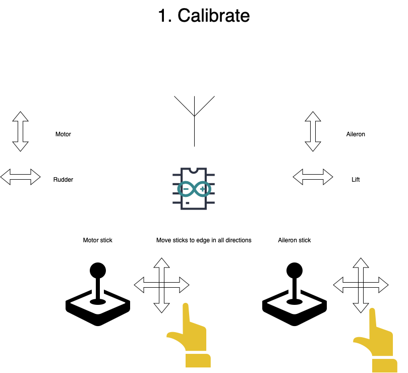
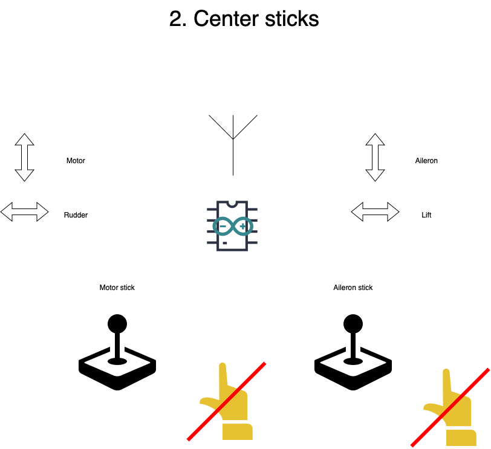
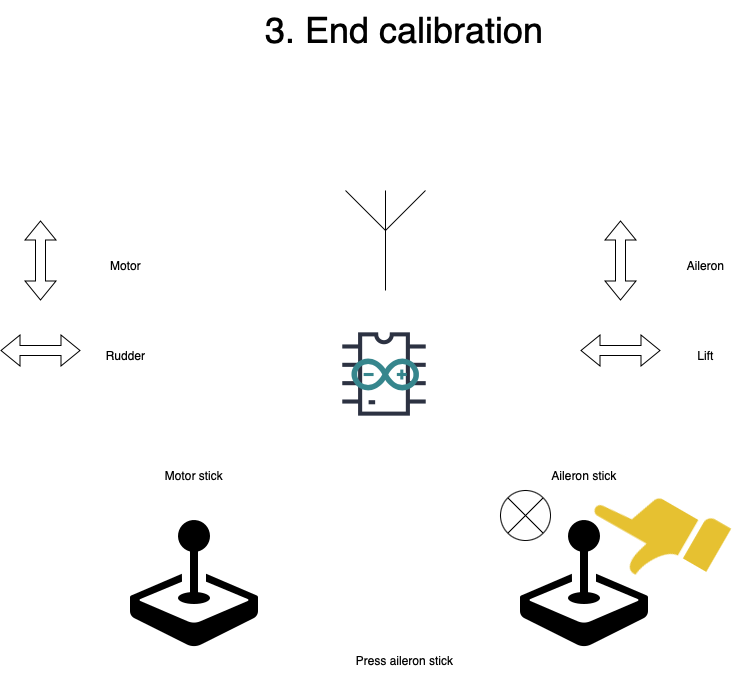
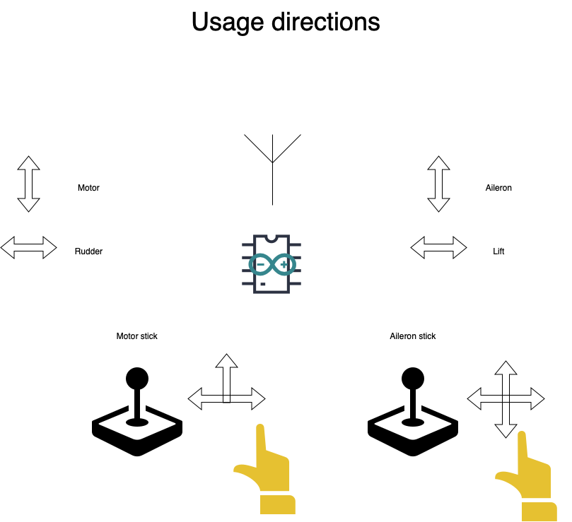
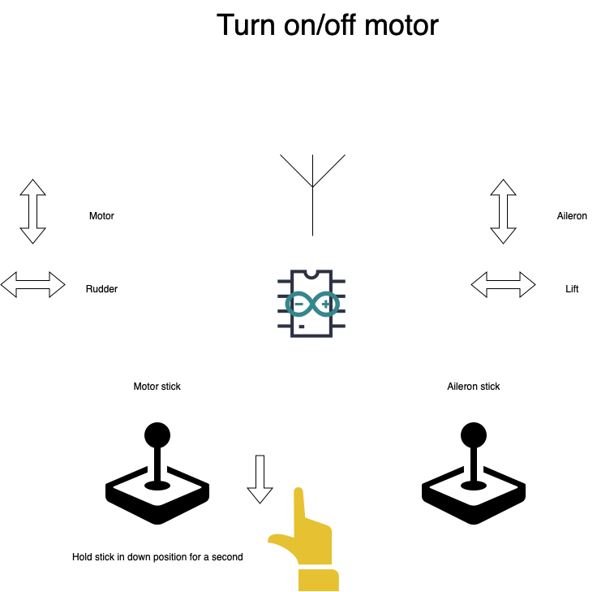
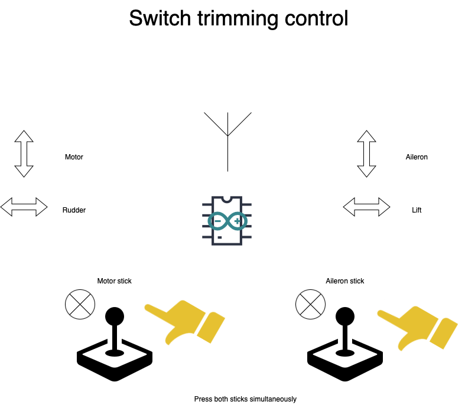
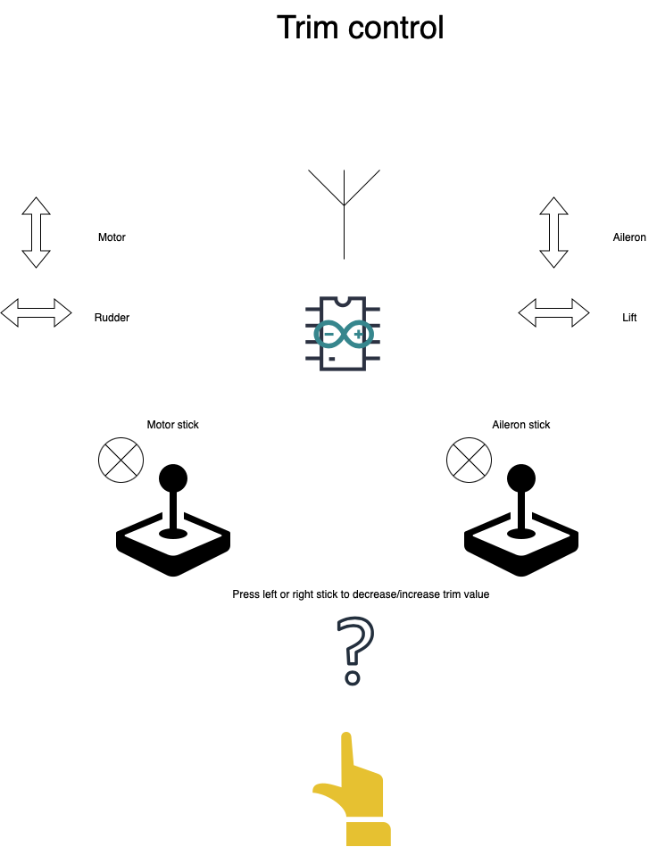

#  BPLA test

## Prereq

1. Download RF24 library
2. Upload [Operator](./Operator) scketch to controller
3. Upload [BPLA](./BPLA) sketch to plane
4. Do plane wiring according to sheme:

```cpp
#define LIFT 4
#define MOTOR 5
#define RUDDER 6
#define ELERON1 9
#define ELERON2 10
```

## Setup







## Usage

**You can see output from controller on serial and plane output on servos and motor** 








